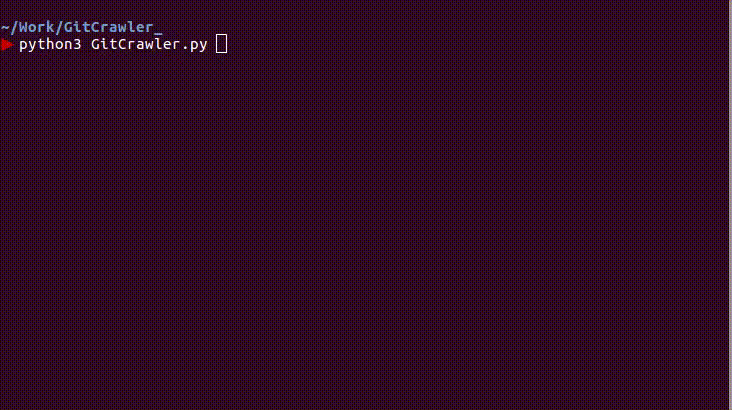
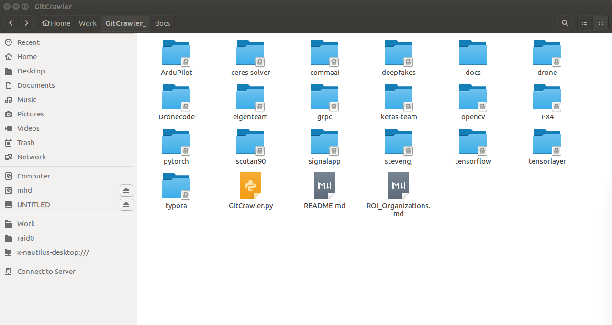
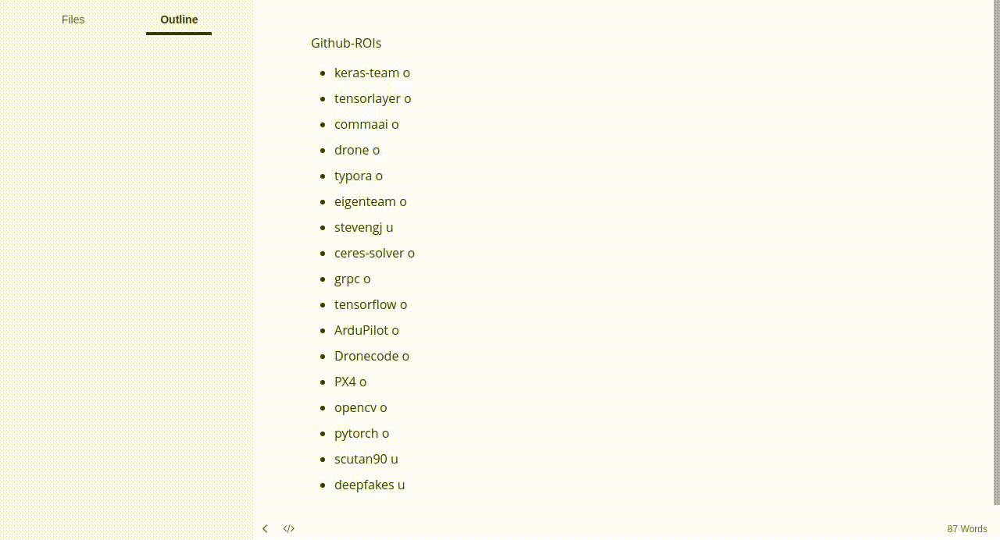
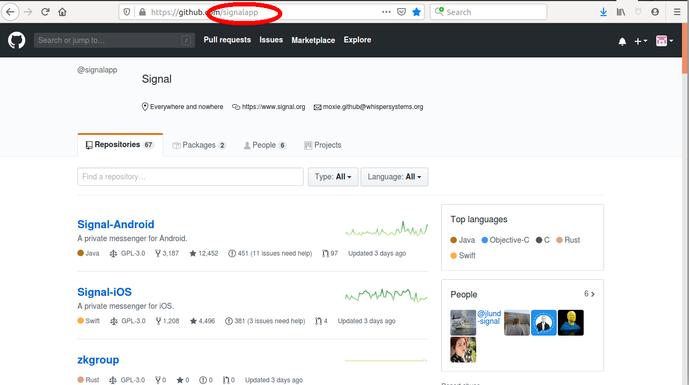

# Github 项目批量抓取器


>  **预防封锁/断网/僵尸世界末日**


## 1. 安装依赖项

此脚本依赖以下项目:

* pip
* python3
* [ghcloneall](https://github.com/mgedmin/ghcloneall) : https://github.com/mgedmin/ghcloneall

其中 pip 和 python 的安装方式请自行查阅. [ghcloneall](https://github.com/mgedmin/ghcloneall) 的安装方式如下 : 

```bash
pip install ghcloneall
```

## 2. 快速上手

1. 进入项目目录

2. 运行 GitCrawler.py

   ```bash
   python3 GitCrawler.py
   ```

3. 运行过程

   此脚本会按照 ROI_Organizations.md 文件中的 Organization (也包含User) 列表去逐个抓取指定机构(Organization)或者用户(User) 名下的所有项目repo. 当目录中不存在对应项目时, 脚本会创建目录并且执行抓取, 如果目录存在则会执行 git pull 操作.

4. 结果

   

   等待运行结束, 你会在目录下看到被抓取的项目(以组织为单位).

   

## 3. 在 ROI 列表加入你需要的组织

修改 ROI_Organizations.md 以添加你自己需要备份的机构代码 . 在这里我们推荐使用 [typora](https://typora.io/)  markdown 编辑器.



1. 确定你需要抓取的组织性质: 是 Organization 还是 User

2. 根据组织的 github 网站后缀, 提取其名称 (OrgName)

   

3. 在 ROI_Organizations.md 中新增一行, 格式为 :

   ```
   * [OrgName] [u | o]
   ```

   其中 u 代表 OrgName 为用户, o 代表 OrgName 为 Organization

   例如:

   ```
   * signalapp o
   ```

   或者:

   ```
   * stevengj u
   ```


## 4. 可能遇到的问题

1. 执行脚本之后很快输出很多 "please make sure you have the correct access rights" 或者 "Permission denied"

   这是由于你需要在本地的terminal设置正确的ssh秘钥, 用来自动验证你的github身份 , 参考以下两篇资料进行设置:

   1. https://blog.csdn.net/kexinmcu/article/details/53166677
   2. https://help.github.com/en/github/authenticating-to-github/connecting-to-github-with-ssh
